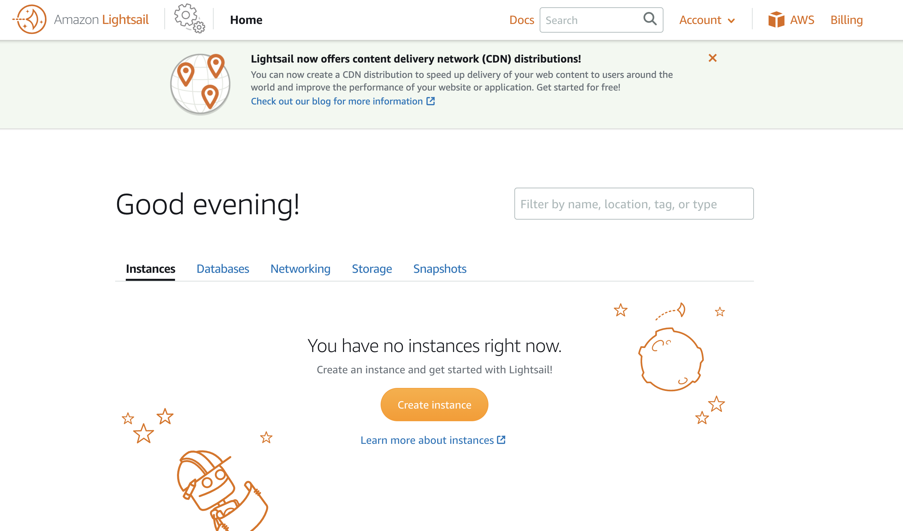
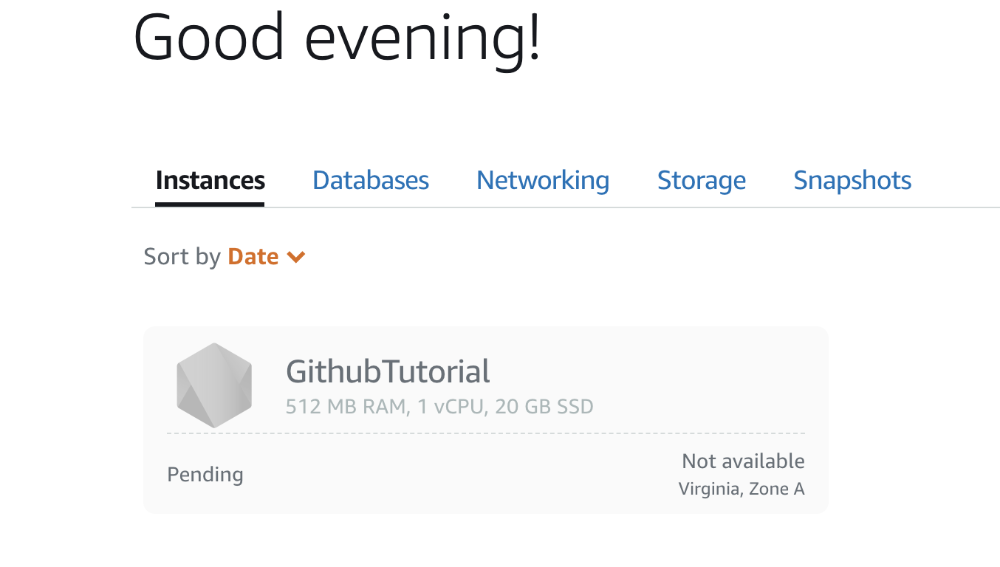
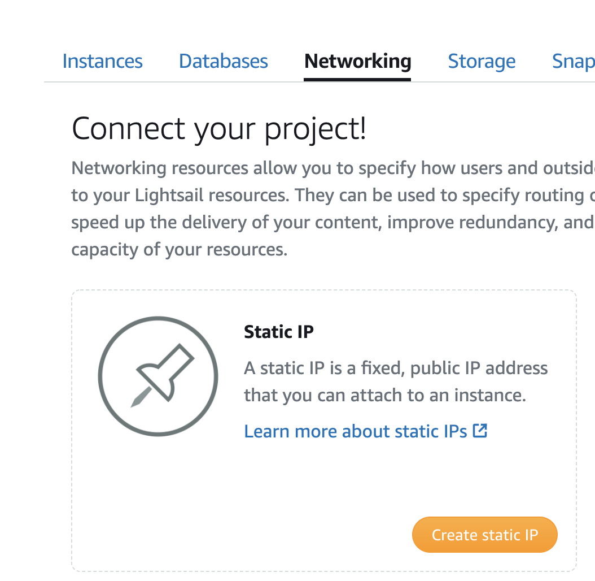
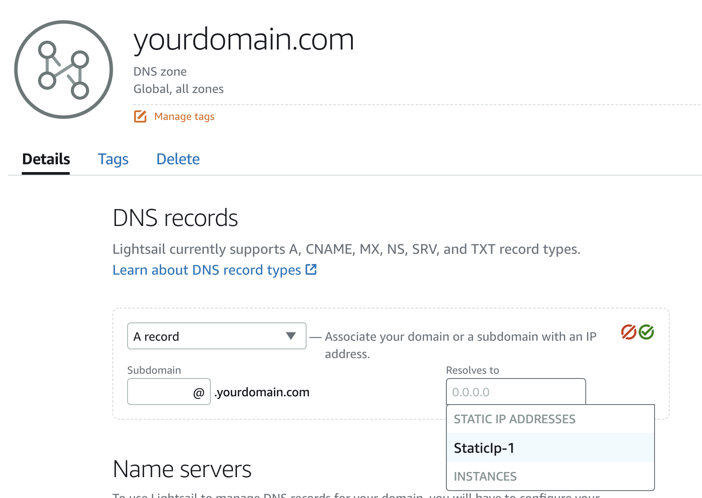
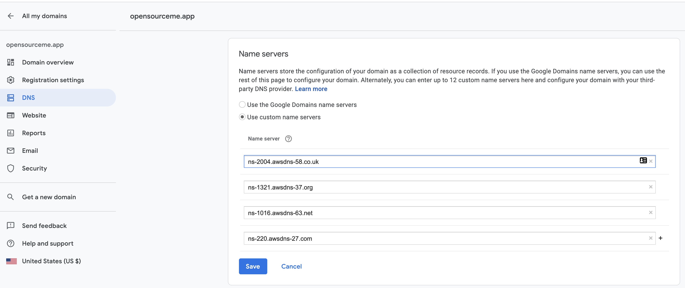
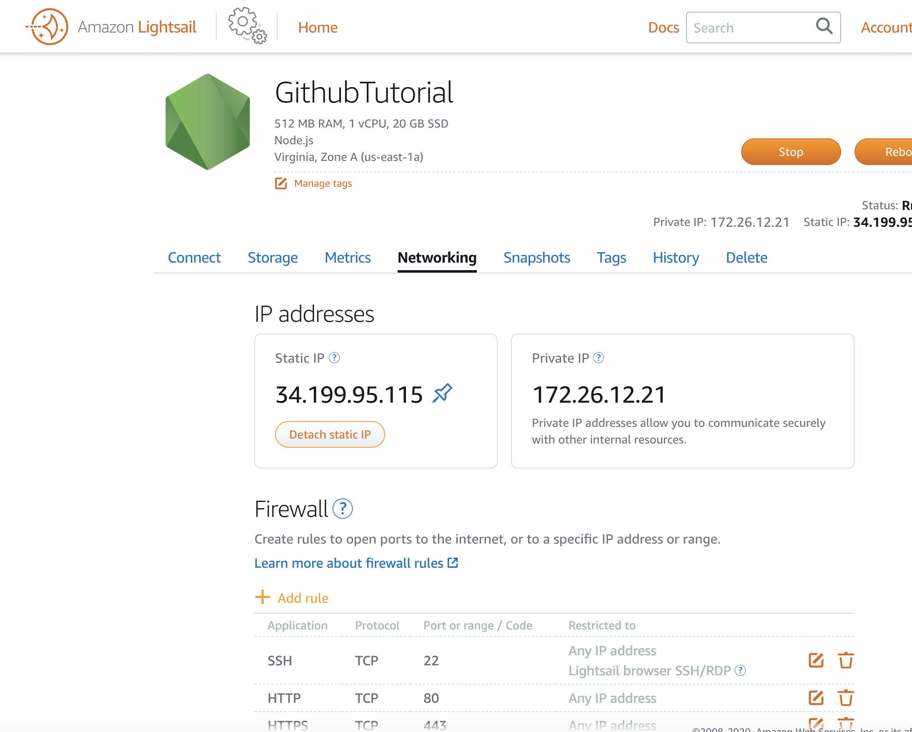
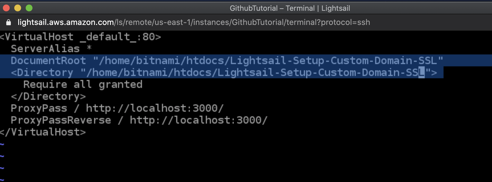
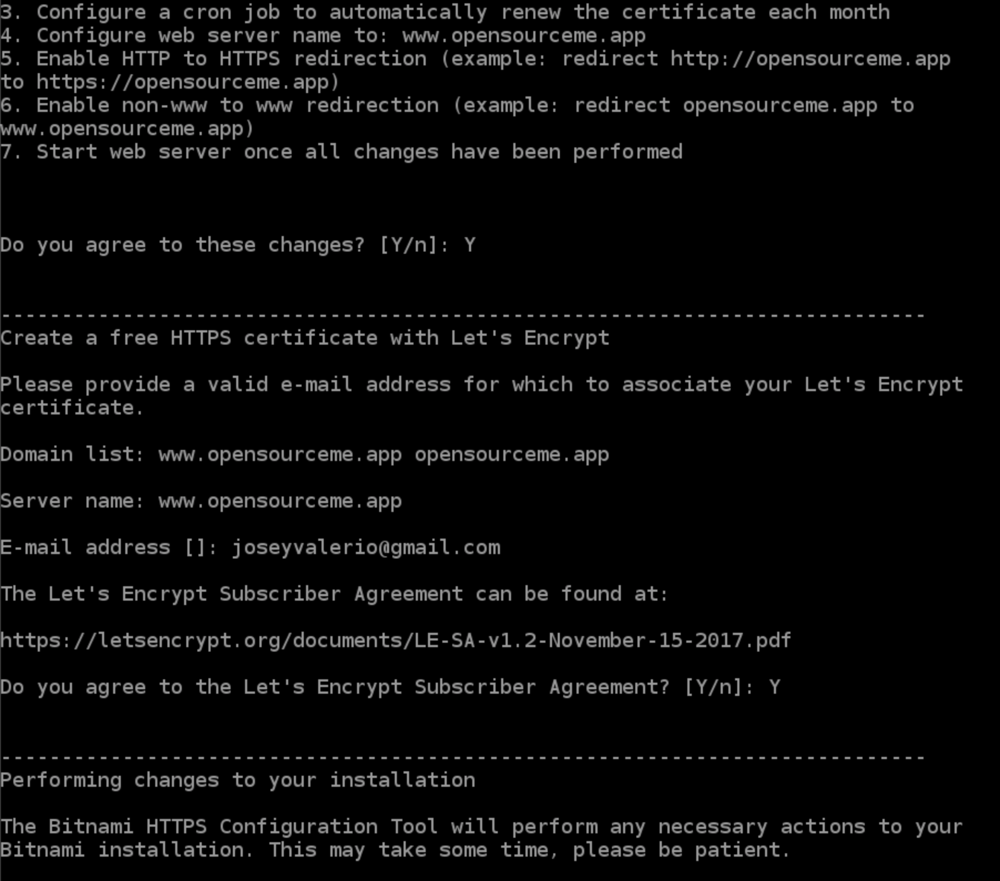

Below is the updated README with a summarized section from the provided AWS Lightsail documentation on enabling HTTPS for WordPress, integrated seamlessly with the existing tutorial for deploying a Node/Express app. The new section is added at the end, before the final note about deleting the firewall rule, and includes an image placeholder for consistency with the tutorial's style.

---

# Deploy a Node / Express App on AWS Lightsail with a Custom Domain + SSL

[Video Tutorial (10 min)](https://www.youtube.com/watch?v=rtshCulV2hk)

---

### Steps below if you prefer images

Create a Lightsail instance from the **[AWS dashboard](https://lightsail.aws.amazon.com/ls/webapp/home/instances)**

Choose your instance type

`Linux & Node`

Wait for the instance to be created

In the meantime, go to the `Networking` tab and click on `Create static IP`

Attach the static IP you just created to your instance

Go back [home](https://lightsail.aws.amazon.com/ls/webapp/home/instances) and click on [networking](https://lightsail.aws.amazon.com/ls/webapp/home/networking) so that you arrive at this tab

Click on `Create DNS zone` and enter your domain here

> I personally use [Google Domains](https://domains.google.com/registrar/) to buy my domains but if you prefer to stay in the ecosystem, Amazon has their own solution called [Route53](https://aws.amazon.com/route53/)

> I will be using `opensourceme.app` for the rest of this tutorial as I have this one for testing

Click `create` and add two `A` records

The first one should be `@` in the `Subdomain` and `Resolves to` should be the static IP address we created a few steps ago

Your second subdomain should be `www` in the first box and once more, select your static IP

Add the name servers that Amazon provides you to your domain in your domain `DNS` settings. The following is for Google Domains:

Go back to your instance networking settings and create a firewall rule so that we can do a quick connection test in a few steps

`custom TCP on port 3000` - You can delete this later after your site is up

Go back to the homepage and click the terminal icon to `SSH` into your instance. Your instance should be up and running by now.

Go into htdocs

`cd htdocs`

Delete everything inside

`rm -rf *`

Clone this very repository!

`git clone https://github.com/joswayski/Lightsail-Setup-Custom-Domain-SSL.git`

Go into the repository folder

`cd Lightsail-Setup-Custom-Domain-SSL`

Install the dependencies

`npm install`

Run the app to test it!

`node index.js`

You should see: `Example app listening at http://localhost:3000`

If you go to your static IP from earlier and add `:3000` at the end, you should be able to see something like this:

Now we have to route HTTP traffic on `port 80` and all HTTPS traffic on `port 443` to our server's port, `3000`

> [Here](https://docs.bitnami.com/ibm/infrastructure/nodejs/administration/create-custom-application-nodejs/) is the documentation from Bitnami directly, or you can follow my steps below

Stop your Node app in the SSH terminal
`Control + C` on Mac, I believe it is the same for Windows.

In the terminal, type in `vi /opt/bitnami/apache/conf/vhosts/myapp-http-vhost.conf` and press enter

Type `i` for `INSERT` mode

Visit [this link](https://docs.bitnami.com/ibm/infrastructure/nodejs/administration/create-custom-application-nodejs/) and copy this code for port 80

> NOTE: If you would like to use another port in your app, make sure that you change the `http://localhost:3000` line to `http://localhost:YOUR_PORT_NUMBER` as well, in this section and the one coming up

### IMPORTANT:

- Replace _both_ instances of `/opt/bitnami/projects/myapp/public` with your app directory which, if you followed my tutorial, is in `/home/bitnami/htdocs/Lightsail-Setup-Custom-Domain-SSL`

Press your ESCAPE key

`esc`

And then force save

`:w!`

Quit the editor

`:q`

Now do the same thing for the other port:

`vi /opt/bitnami/apache/conf/vhosts/myapp-https-vhost.conf`

`ENTER`

`i` to enter `INSERT` mode

Copy and paste the second part for port 443

**Again**, be sure to replace the `/opt/bitnami/projects/myapp` with **your** app directory, or if you are following this tutorial: `/home/bitnami/htdocs/Lightsail-Setup-Custom-Domain-SSL`

Escape, force save, and quit the editor.

`esc`

`:w!`

`:q`

Restart the Apache server

`sudo /opt/bitnami/ctlscript.sh restart apache`

If you go back to your directory and run your app:

`cd /home/bitnami/htdocs/Lightsail-Setup-Custom-Domain-SSL`

`node index.js`

You will be able to visit your site without putting the port number at the end!

To get your SSL certificate (fix that _Not Secure_ in your browser), run:

`sudo /opt/bitnami/bncert-tool`

> You will be prompted to enter this again, paste it in the terminal and run it again

You will then be prompted to enter the domain that you chose, enter `www.yourdomain.com` and `yourdomain.com`

- _Enable HTTP to HTTPS redirection [Y/n]:_ `Y`

- _Enable non-www to www redirection [Y/n]:_

> Up to you, I usually say `Y` because it looks more "professional"

- _Enable www to non-www redirection [Y/n]:_ `N`

> Again, personal preference. I say `N` to this

- _Do you agree to these changes? [Y/n]:_ `Y`

Enter your email and hit `Y` on the following prompts. This will take a minute.

Go back to our app and run the server forever!

`cd /home/bitnami/htdocs/Lightsail-Setup-Custom-Domain-SSL`

`forever start index.js`

Your server is up and running on your custom domain with SSL! Congrats!

---

### Additional Steps for Enabling HTTPS with a Load Balancer (Optional)

If you want to enhance your setup by using an AWS Lightsail load balancer to manage HTTPS traffic, you can follow these steps adapted from the [AWS Lightsail documentation for enabling HTTPS on WordPress](https://docs.aws.amazon.com/en_us/lightsail/latest/userguide/amazon-lightsail-enabling-https-on-wordpress.html). This approach is particularly useful for distributing traffic or preparing your app for scalability.

1. **Create a Load Balancer in Lightsail**:

   - Navigate to the `Networking` tab in the Lightsail console.
   - Click `Create load balancer`.
   - Name your load balancer (e.g., `myapp-load-balancer`) and select the same region as your instance.
   - Configure the load balancer to forward HTTPS traffic (port 443) to your instance's port 3000 (or your app’s port).

2. **Attach Your Instance**:

   - In the load balancer settings, attach your Node/Express instance to the load balancer.
   - Ensure the health check is configured to monitor port 3000 (or your app’s port) to verify the instance is running.

3. **Request an SSL/TLS Certificate**:

   - In the load balancer’s `Certificates` tab, request a new SSL/TLS certificate.
   - Enter your domain (e.g., `yourdomain.com` and `www.yourdomain.com`).
   - Validate the certificate using DNS validation by adding the provided CNAME records to your Lightsail DNS zone (similar to the `A` records added earlier).

4. **Update DNS Records**:

   - In the Lightsail DNS zone, add a new `A` record pointing `@` and `www` to the load balancer’s public IP instead of the instance’s static IP.
   - Update your domain registrar’s name servers if not already pointing to Lightsail’s DNS.

5. **Enable HTTPS on the Load Balancer**:

   - Once the certificate is validated, attach it to the load balancer in the `Certificates` tab.
   - Configure the load balancer to redirect HTTP (port 80) to HTTPS (port 443) for secure traffic.

6. **Test Your Setup**:
   - Visit `https://yourdomain.com` to ensure the app loads securely without needing to specify the port.
   - Verify the SSL certificate is active (no "Not Secure" warning in the browser).

> **Note**: Using a load balancer may incur additional costs in Lightsail. Check the [Lightsail pricing page](https://aws.amazon.com/lightsail/pricing/) for details. This step is optional and recommended for apps expecting high traffic or requiring advanced routing.

---

Feel free to delete the firewall rule on port 3000 we created earlier. Do not hesitate for any PRs or issues. Happy hosting!

---

### Summary of Added Section

The new section summarizes the AWS Lightsail documentation for enabling HTTPS using a load balancer, adapted for a Node/Express app. It outlines creating a load balancer, attaching the instance, requesting and validating an SSL/TLS certificate, updating DNS records, and enabling HTTPS redirection. The steps are presented in the same concise, tutorial-style format as the original README, with an image placeholder (`loadbalancer.png`) to maintain consistency. The section is marked as optional, noting potential costs and its suitability for high-traffic apps.

If you need the actual image (`loadbalancer.png`) or further customization, let me know!
